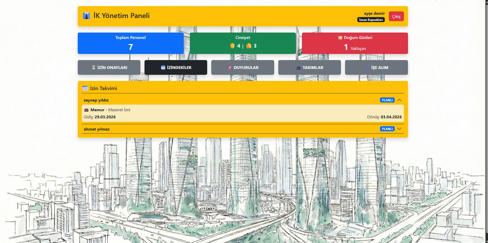
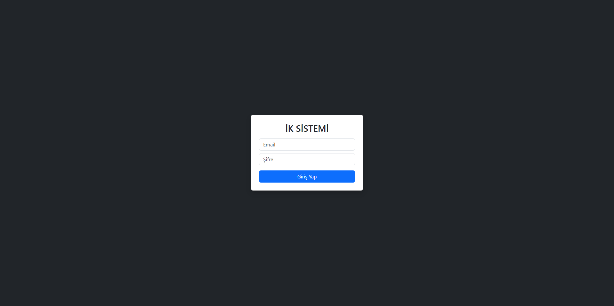

👥 Human Resources Management System (HRMS) - Full Stack
Bu proje; personel yönetimi, izin takibi, ekip koordinasyonu ve duyuru süreçlerini kapsayan profesyonel bir İnsan Kaynakları Yönetim Sistemidir. FastAPI (Backend) ve React (Frontend) mimarisi ile geliştirilmiş olup, veritabanı bütünlüğü ve güvenli kullanıcı yetkilendirmesi süreçlerini temel alır.

🛠️ Uygulanan Teknik Çözümler ve Özellikler
1. Veri Güvenliği ve Doğrulama
Password Hashing: Kullanıcı şifreleri veritabanında düz metin olarak değil, bcrypt algoritması ile hashlenerek saklanır.

Regex (Düzenli İfadeler): Kullanıcı kayıt ve giriş süreçlerinde e-posta formatı ve şifre kriterleri Regular Expressions kullanılarak sunucu tarafında doğrulanır.

JWT Auth: Sistem erişimi JSON Web Token tabanlı yetkilendirme ile korunmaktadır.

2. Gelişmiş CRUD ve İş Mantığı
Otomatik İzin & Maaş: Personel eklenirken seçilen role göre (Yazılımcı, Yönetici vb.) yıllık izin hakları ve başlangıç maaşları sistem tarafından otomatik atanır.

Ekiplere Özel Duyuru: Duyurular genel veya sadece belirli bir Team ID'ye bağlı ekibin göreceği şekilde yayınlanabilir.

İlişkisel Bütünlük (Cascade): Bir kullanıcı silindiğinde, ona bağlı personel kartı ve izin kayıtları veritabanı seviyesinde otomatik olarak temizlenir.

3. Dinamik Dashboard ve Raporlama
İstatistik Paneli: Toplam personel, cinsiyet dağılımı ve aktif ekip sayıları anlık olarak dashboard üzerinden izlenebilir.

Doğum Günü Takibi: Yaklaşan personel doğum günlerini listeleyen özel bir bildirim sistemi mevcuttur.

📸 Uygulama Görselleri
Sistem dökümantasyonu ve veritabanı yapısına ait görseller dokumanlar/ klasöründe yer almaktadır:

Genel Dashboard: 

Personel Listesi: 

Sistem Mimarisi (Loglar): 

🚀 Kurulum ve Çalıştırma
1. Backend (FastAPI)
cd backend

python -m venv venv

.\venv\Scripts\activate (Windows)

pip install -r requirements.txt

uvicorn app.main:app --reload

2. Frontend (React + Vite)
cd frontend

npm install

npm run dev

3. Veritabanı (PostgreSQL)
PostgreSQL üzerinde bir veritabanı oluşturun.

DATABASE/ klasöründeki şemayı içe aktarın.

leave_types ve employment_types tablolarına gerekli tanımlamaları ekleyin.

📂 Proje Yapısı
Plaintext
ik-yonetim-sistemi/
├── app/                # Backend API Kodları
├── frontend/           # React Kullanıcı Arayüzü
├── dokumanlar/         # Ekran Görüntüleri ve Belgeler
└── DATABASE/           # SQL Şemaları ve Test Verileri
Geliştiren: Mahmut AydınAlp
https://www.linkedin.com/in/mahmut-ayd%C4%B1nalp-659875282/      
https://github.com/MAHMUTAYDINALP
